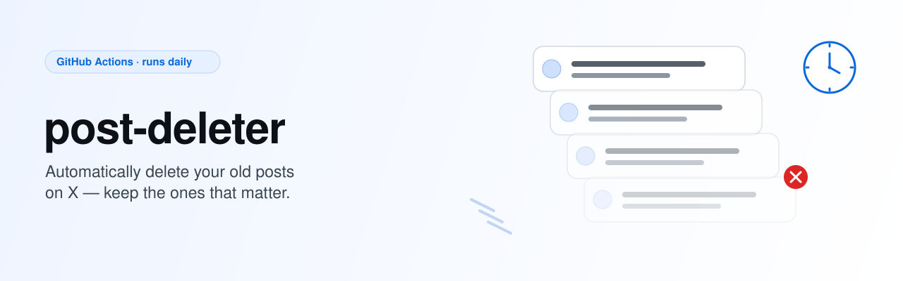

<picture>
  <source media="(prefers-color-scheme: dark)" srcset="docs/assets/hero-dark.svg">
  <source media="(prefers-color-scheme: light)" srcset="docs/assets/hero-light.svg">
  
</picture>

# post-deleter

[](https://github.com/75asa/post-deleter/actions/workflows/ci.yml)
[](LICENSE)

Automatically delete your old posts on X.

> [!WARNING]
> The X API is pay-per-use and has no free tier.
> Buy credits and set a spending limit in the [X Developer Console](https://console.x.com/) before running this.
> See [X API pricing](https://docs.x.com/x-api/getting-started/pricing) for details.

## How it works

1. A scheduled GitHub Actions workflow runs daily.
2. It scans your posts and deletes the ones older than yesterday 0:00 JST.
3. Posts matching your keep rules are skipped.

## Requirements

- Node.js 24.2 or later
- An X Developer app with Read and Write permission

## Usage (GitHub Actions)

1. Fork this repository.
2. Set `Secrets` on the repository (`CONSUMER_KEY` / `CONSUMER_SECRET` / `ACCESS_TOKEN` / `ACCESS_TOKEN_SECRET`).
3. Enable the `delete-tweets` workflow on the Actions tab (scheduled workflows are disabled on forks by default).
4. It runs automatically at 0 o'clock Japan time (GMT+09:00).

You can also run it manually from the Actions tab with `dry_run` enabled.

## Usage (local)

Fork and clone, then:

```bash
$ cp _env .env
```

Fill in `CONSUMER_KEY` / `CONSUMER_SECRET` / `ACCESS_TOKEN` / `ACCESS_TOKEN_SECRET`, then:

```bash
$ npm ci
$ DRY_RUN=1 npm run start # only log the posts to delete
$ npm run start
```

## Configuration

<!-- TODO: this section will be filled in as configuration options land (X API v2 env vars such as
     LOOKBACK_DAYS / FULL_SCAN / MAX_DELETES / X_USER_ID, and a keep-rules.json for keep rules). -->

Currently supported environment variables:

| Variable | Description |
| --- | --- |
| `CONSUMER_KEY` | X API consumer key |
| `CONSUMER_SECRET` | X API consumer secret |
| `ACCESS_TOKEN` | X API access token |
| `ACCESS_TOKEN_SECRET` | X API access token secret |
| `DRY_RUN` | When set, only logs the posts that would be deleted |

## Development

```bash
$ npm run check     # lint and format (Biome)
$ npm run typecheck
$ npm test
```

## Credits

Forked from [takanakahiko/tweet-deleter](https://github.com/takanakahiko/tweet-deleter), created by [@takanakahiko](https://github.com/takanakahiko). Thank you for the original work!

## License

MIT &copy; takanakahiko, 75asa
